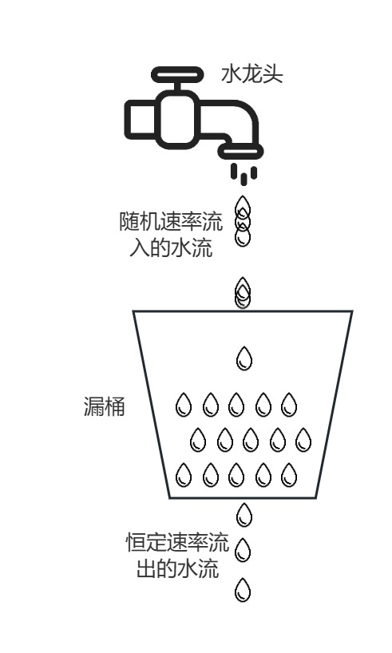

# Rate Limit 限流

限流，即流量控制。指的是在系统面临高并发，或者大流量请求的情况下，限制一定时间内可处理的请求数，也就是限制新的请求对系统的访问，从而保证系统的稳定性和安全性。\
但是，限流会导致出现部分用户请求无法被处理或延迟处理，影响用户体验。

> <span style="font-size: larger;">[!**为什么需要限流**]</span>
> 
> - 防止滥用：通过限制每个用户或IP地址的请求频率，防止恶意用户或攻击者对系统进行滥用和破坏，例如DOS攻击。
> 
> - 防止过载：当大量请求同时到达系统时，如果系统无法合理地接收并处理这些请求，可能会导致系统资源被耗尽，甚至宕机崩溃。

## Fixed Window 固定窗口限流（计数器限流）

固定窗口限流又称计数器限流（Fixed Window）算法，是最简单的限流算法，通过<span style="color: orange;">**在单位时间内维护的计数器来控制该时间单位内的最大访问量**</span>。\
它的工作原理是：在每个固定的时间窗口内，系统会记录请求的数量，当请求数量超过预设的阈值时，系统会拒绝后续的请求。

### 工作原理
首先维护一个计数器，将单位时间段当做一个窗口，计数器记录这个窗口接收请求的次数。
- 当次数少于限流阀值，就允许访问，并且计数器+1
- 当次数大于限流阀值，就拒绝访问。
- 当前的时间窗口过去之后，计数器清零。


固定窗口最大的优点在于易于实现；并且内存占用小，我们只需要存储时间窗口中的计数即可；它能够确保处理更多的最新请求，不会因为旧请求的堆积导致新请求被饿死。\
当然也面临着**临界问题**，当两个窗口交界处，瞬时流量可能为2n：\
假设限流阀值为5个请求，单位时间窗口是1s,如果我们在单位时间内的前0.8-1s和1-1.2s，分别并发5个请求。虽然都没有超过阀值，但是如果算0.8-1.2s,则并发数高达10，已经超过单位时间1s不超过5阀值的定义啦。


### 算法实现

源代码：[FixedWindowRateLimiter](./src/main/java/rate_limit/FixedWindowRateLimiter.java)

```java
public boolean tryAcquire() {
    long now = System.currentTimeMillis(); // 当前时间

    // 若请求超出当前时间窗口
    if (now - lastRequestTimestamp > windowSizeInMilliseconds) {
        counter = 0; // 重置计数器
        lastRequestTimestamp = now;
    }

    if (counter < maxRequests) {
        counter++; // 增加计数器
        return true; // 允许通过
    } else {
        return false; // 被限流
    }
}
```

## Sliding Window 滑动窗口限流

滑动窗口限流是一种流量控制策略，用于<span style="color: orange;">**控制在一定时间内允许执行的操作数量或请求频率**</span>。\
它的工作方式类似于一个滑动时间窗口，对每个时间窗口的请求数量进行计数，并根据预先设置的限流策略来限制或调节流量，通常包括以下几个要素：

- **时间窗口**：限流的时间段，例如每秒、每分钟或每小时，窗口可以固定，也可以动态调整。
- **滑动窗口**：在整个事件窗口内滑动的小窗口，用于计算当前时间段内的请求数量。
- **计数器**：用于记录当前窗口内的请求数量数量。
- **限流策略**：预先设定的限流规则，例如允许的最大请求数量，以及如何处理超出限制的请求（例如拒绝、延迟处理）等。

### 工作原理


当前时间为12：01，计数器为200个，也就是每分钟允许的请求数量为200个，当12点01分59秒第201个请求进来了，那么会直接触发限流策略。假设到了12点一分零1秒，系统会把12点至12点零一分的请求数量给移除。

<span style="color: orange;">**当时间窗口移动时，需要把上一个时间段中的请求数量给减掉，当有新请求或操作进来时，系统会检查窗口内的计数是否已满，如果没满，请求允许执行，反之触发限流策略，比如被拒绝或者进入等待队列。**</span>

### 算法实现

源代码：[SlidingWindowRateLimiter](./src/main/java/rate_limit/SlidingWindowRateLimiter.java)

```java
public boolean tryAcquire() {
    long now = System.currentTimeMillis(); // 当前时间
    long before = now - windowSizeInMilliseconds; // 窗口开始时间

    // 移除窗口之前的记录
    jedis.zremrangeByScore(key, 0, before);

    // 查询当前窗口内的请求数量
    long currentRequests = jedis.zcard(key);

    if (currentRequests < maxRequests) {
        // 添加当前请求的时间戳
        jedis.zadd(key, now, String.valueOf(now));
        return true;
    }

    return false;
}
```

## Leaky Bucket 漏桶算法

算法原理就是模拟注水漏水的过程。\
漏桶以任意速率流入水，以固定的速率流出水。当注入速度持续大于漏出的速度时，漏桶会变满发生溢出，此时新进入的请求将会被丢弃。\
因为桶容量是不变的，保证了整体的速率。

**限流**和**整形**是漏桶算法的两个核心能力。
漏桶算法通常用于限制网络流量、控制数据传输速率等场景，但是<span style="color: red;">**无法应对突发的高流量**</span>。

漏桶算法的核心思想是将请求排队，以固定的频率处理请求，超出容量的请求会被丢弃，从而控制请求的最大流量。其核心思路包括以下几个要点：
- **请求队列**：漏桶算法将所有请求放入一个容量固定的队列，称为请求桶。
- **固定频率消费**：请求会以固定频率从请求桶中取出并处理，确保系统请求处理的平稳性。
- **请求丢弃**：如果请求桶已满，新来的请求会被直接丢弃，从而避免超过系统承载能力的流量进入。

### 工作原理



假设我们有一个请求桶，容量为100个请求，处理频率为每秒处理10个请求。当桶中请求达到100个时，新的请求会被丢弃，只有当处理完10个请求后才能继续放入新的请求。
- 流入的水滴，可以看作是访问系统的请求，这个流入速率是不确定的。
- 桶的容量一般表示系统所能处理的请求数。
- 如果桶的容量满了，就达到限流的阀值，就会丢弃水滴（拒绝请求）
- 流出的水滴，是恒定过滤的，对应服务按照固定的速率处理请求。

### 算法实现

源代码：[LeakyBucketRateLimiter](./src/main/java/rate_limit/LeakyBucketRateLimiter.java)

```java
private void startConsuming(int threadPoolSize) {
    ScheduledExecutorService executor = Executors.newScheduledThreadPool(threadPoolSize);

    // 添加 JVM 关闭钩子，确保线程池在程序终止时关闭
    Runtime.getRuntime().addShutdownHook(new Thread(() -> {
        log.info("Shutting down ScheduledExecutorService...");
        executor.shutdown();
        try {
            if (!executor.awaitTermination(5, TimeUnit.SECONDS)) {
                executor.shutdownNow();
            }
        } catch (InterruptedException e) {
            executor.shutdownNow();
        }
    }));

    executor.scheduleAtFixedRate(() -> {
        Runnable request = bucket.poll();
        if (request != null) {
            request.run();
        }
    }, 0, leakRate, TimeUnit.MILLISECONDS); // 每秒消费一次

}

public boolean tryAcquire(Runnable request) {
    return bucket.offer(request);
}
```

### 漏桶算法的优缺点

**优点**
- **流量平滑**：漏桶算法可以平滑处理请求流量，防止突发流量对系统的冲击。
- **实现简单**：漏桶算法的设计和实现都比较简单，适用于限流要求不复杂的场景。

**缺点**
- **低效资源利用**：即便系统负载较低，漏桶算法也会严格按照频率处理请求，可能导致资源利用不充分。
- **丢弃超限请求**：对于不希望丢弃请求的场景，漏桶算法可能并不适合。

## Token Bucket 令牌桶算法

令牌桶算法是一种常见的限流算法，通过为请求分配令牌来限制请求的进入频率，以此来平滑流量。

令牌桶算法（Token Bucket）通过在固定时间间隔生成令牌，并为请求分配令牌来决定是否允许请求进入。如果令牌桶满了，新增的令牌会被丢弃，而没有令牌的请求则会被限制进入系统。这样可以有效平滑请求流量，避免流量暴增导致系统过载。

令牌桶算法的核心思想是将请求分配给令牌，只有持有令牌的请求才能被处理。其核心思路包括以下几个要点：
- **令牌生成**：令牌会以固定的速率生成，存放在一个容量固定的令牌桶中。
- **令牌桶的容量限制**：如果令牌桶达到上限，新增的令牌将被丢弃。
- **请求处理**：每个请求进来时，先从令牌桶中申请令牌；如果成功获得令牌，则允许请求继续，否则请求被丢弃或延迟。

### 工作原理


假设令牌桶的容量为10，每秒生成5个令牌。当一个请求到来时，如果桶内有令牌，则允许请求通过并消耗一个令牌。若桶中无令牌，且令牌生成速率较慢，则该请求被拒绝。

### 算法实现

源代码：[TokenBucketRateLimiter](./src/main/java/rate_limit/TokenBucketRateLimiter.java)

```java
private void startRefilling(int threadPoolSize) {
    ScheduledExecutorService executor = Executors.newScheduledThreadPool(threadPoolSize);

    // 添加 JVM 关闭钩子，确保线程池在程序终止时关闭
    Runtime.getRuntime().addShutdownHook(new Thread(() -> {
        log.info("Shutting down ScheduledExecutorService...");
        executor.shutdown();
        try {
            if (!executor.awaitTermination(5, TimeUnit.SECONDS)) {
                executor.shutdownNow();
            }
        } catch (InterruptedException e) {
            executor.shutdownNow();
        }
    }));

    executor.scheduleAtFixedRate(() -> {
        int currentTokens = tokens.get();
        if (currentTokens < bucketCapacity) {
            int newTokens = Math.min(bucketCapacity, currentTokens + 1);
            tokens.set(newTokens);
            System.out.println(LocalDateTime.now() + "\t\t新增令牌，当前令牌数：" + newTokens + "\tat " + System.currentTimeMillis());
        }
    }, 0, refillRate, TimeUnit.MILLISECONDS); // 每秒填充令牌
}

public boolean tryAcquire() {
    int currentTokens = tokens.get();
    if (currentTokens > 0) {
        if (tokens.compareAndSet(currentTokens, currentTokens - 1)) {
            System.out.println(LocalDateTime.now() + "\t\t消耗令牌，剩余令牌数：" + (currentTokens - 1) + "\tat " + System.currentTimeMillis());
            return true;
        }
    }
    return false;
}
```

### 令牌桶算法的优缺点

**优点**
- **处理突发流量**：令牌桶算法能够更灵活地应对突发流量，在限流的同时可以允许一定量的突发请求。
- **资源利用率高**：令牌桶算法根据实际流量生成令牌，能够较为高效地利用系统资源。

- **缺点**
- **实现复杂**：相比于漏桶算法，令牌桶算法的实现较为复杂，可能需要更多的调参工作。
- **限流不稳定**：突发流量较大时，仍然可能对系统带来一定冲击。
